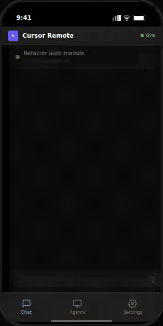
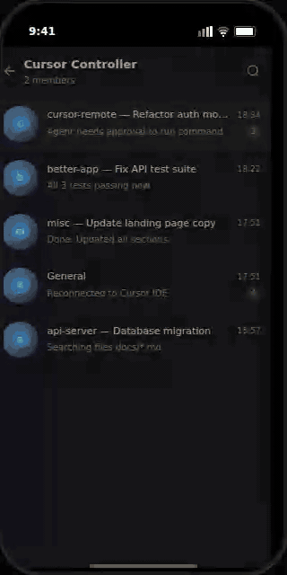
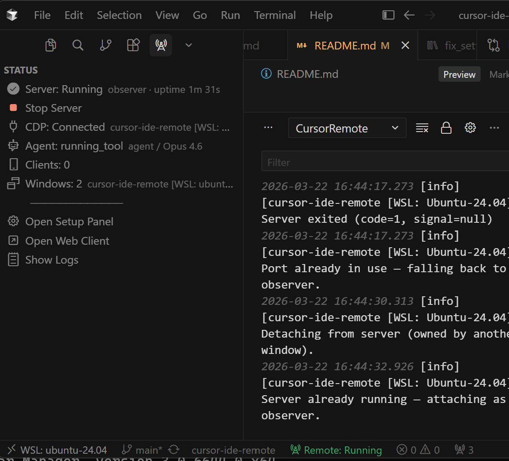

# CursorRemote

在手机、平板或其他电脑上远程查看和控制本机 Cursor AI 智能体。CursorRemote 通过 Chrome DevTools Protocol（CDP）读取 Cursor 会话状态，再通过移动端 Web 客户端或 Telegram 提供消息查看、任务发送、审批、问卷回答、计划审阅以及窗口、会话、模式和模型切换。

> CursorRemote 在你的机器上运行，不上传代码或会话数据。除可选的 Telegram Bot API 外，不依赖云端中继服务。

<div align="center">

| 移动端 Web 客户端 | Telegram |
|:-:|:-:|
|  |  |

<p><b>Cursor 扩展侧栏</b>：查看服务器、CDP、智能体和客户端状态，并控制服务器启停。</p>


</div>

## 核心功能

### 远程查看与操作

- 实时显示用户消息、助手回复、思考步骤、工具调用、待办列表和运行状态。
- 远程发送新任务、创建新会话、切换 Cursor 窗口和聊天会话。
- 处理全局审批和工具卡操作，包括接受、拒绝、运行、跳过、允许、继续和构建计划。
- 查看终端命令的完整内容后再决定是否执行。
- 回答智能体选择题问卷，支持选中态、自由输入、跳过和继续。
- 查看 Composer 中排队的提示。

### 计划、代码与差异内容

- 显示计划标题、说明、任务进度和逐项状态。
- 从当前会话的 Plans 栏或计划卡打开完整计划；服务端仅允许读取 `~/.cursor/plans` 下当前会话已观察到的安全普通文件。
- 获取 Cursor 当前可用的计划模型并远程切换，或直接触发 Build。
- 原生渲染代码块和文件差异，不复制易损的 Monaco/Shiki 页面结构。
- 长代码和差异默认显示约 7 行可滚动视图，可展开为全屏阅读器。
- 工具卡显示文件名、增删行统计和可见摘要，便于在窄屏上快速判断操作内容。

### 多窗口与多会话

- Web 顶部上下文栏显示“窗口 › 会话”，抽屉统一列出所有已发现的 Cursor 窗口和会话。
- 当前主窗口保持持久 CDP 连接并连续更新。
- 其他 Cursor 窗口每 10 秒使用临时 CDP 连接并行轮询，不切换桌面端 Cursor 的可见焦点。
- 扩展采用单例服务器模式：一个窗口拥有服务器进程，其他窗口作为观察者；所有者关闭后，观察者可自动接管。

### 运行时能力发现

Cursor 的内部界面会随版本变化。CursorRemote 不再只依赖固定的模式、模型和工具列表，而是维护独立的运行时能力状态：

- 校验 CDP 端点是否属于 Cursor，并验证目标页面是否为 Cursor Workbench。
- 被动探测当前 Composer、模式、模型和工具能力，区分“不可用”“未知”“部分发现”“已过期”和“正常”。
- 在 Web 客户端的 **Capabilities** 区域显示发现状态、完整性和诊断信息。
- 点击 **Refresh Cursor capabilities** 时执行受控的交互式探测，重新读取 Cursor 当前菜单。
- 模式和模型切换只允许使用当前目标、当前版本且已验证的能力项。
- 探测可以生成待确认适配候选；**当前版本不会自动激活候选适配器**，现有内置选择器仍是活动路径。

### Telegram

- 将每个项目/智能体会话映射到 Telegram 超级群组的论坛话题。
- 新会话自动创建话题，并持续新增或更新消息。
- 通过内联按钮处理审批、工具操作、计划和问卷。
- 在话题中发送普通文本即可把任务转发给对应的 Cursor 智能体。
- 支持话题清理、去重、重新绑定和状态恢复。
- 默认使用 grammY，也提供基于 Node.js `fetch` 的 `raw` 传输实现作为网络兼容回退。

### 连接与通知

- Socket.IO 自动重连，重连后获取完整状态。
- 分别展示浏览器到中继、CDP 到 Cursor、DOM 提取和能力发现状态，避免把后台节流误报为普通断网。
- 页面在后台时，对待审批、运行命令、工具操作和问卷等事件发送去重的浏览器通知。
- Web 客户端支持浅色、深色和跟随系统主题。

## 工作原理

```text
Cursor IDE
  │  CDP：读取 DOM、输入文本、点击已验证操作
  ▼
CursorRemote 中继服务器（Node.js + TypeScript）
  ├─ 状态提取与差异广播
  ├─ 目标和能力发现
  ├─ 命令执行与操作授权
  ├─ Socket.IO ──────────────► Web 客户端
  └─ Bot API ────────────────► Telegram
```

1. **Cursor IDE** 启用 Chrome DevTools 协议运行（`--remote-debugging-port=9222`）。
2. **中继服务器** 通过 CDP 连接，从 DOM 提取智能体聊天状态，经能力发现校验后广播差异。
3. **窗口监控器** 在主窗口保持长连接的 CDP 连接，每 10 秒并行轮询其他窗口。
4. **浏览器客户端** 在任何设备上实时显示对话，并可发送命令。
5. **Telegram 机器人**（可选）将数据镜像到自动创建的论坛话题。

## 我应该使用哪种设置方式？

| | 扩展（推荐） | 独立服务器 |
|---|---|---|
| **适用于** | 开发机器的日常使用 | 无头服务器、CI 或手动配置 |
| **安装** | 单个 `.vsix` 文件 | 克隆仓库 + `npm install` |
| **配置** | VS Code 设置 + 设置面板 | `.env` 文件 |
| **服务器生命周期** | 自动启动，侧边栏启动/停止 | 手动 `npm run dev` 或 `npm start` |
| **状态 UI** | 侧边栏面板显示实时状态 | 终端日志 + `/health` 端点 |
| **密码** | 首次安装时自动生成 | 手动在 `.env` 中配置 |
| **多窗口** | 单例 — 所有窗口共用一个服务器 | 单进程 |

---

## 设置 A：扩展（推荐）

### 1. 安装扩展

从 [releases](https://github.com/yaogjim/CursorRemoteControl/releases) 下载最新的 `.vsix` 文件，然后安装：

```bash
# 从命令行安装
cursor --install-extension cursor-remote-0.1.59.vsix
```

或在 Cursor 中：打开命令面板（`Ctrl+Shift+P`），运行 **Extensions: Install from VSIX...**，然后选择文件。

### 2. 启用 CDP 并启动 Cursor

在 Cursor 快捷方式中添加 `--remote-debugging-port=9222`，或运行：

```powershell
# Windows
& "$env:LOCALAPPDATA\Programs\cursor\Cursor.exe" --remote-debugging-port=9222
```

```bash
# macOS
open -a Cursor --args --remote-debugging-port=9222
```

```bash
# Linux
cursor --remote-debugging-port=9222
```

**重要提示：** 添加标志后完全退出并重启 Cursor。在 macOS 上使用 Cmd+Q（不只是关闭窗口）。验证：`http://localhost:9222/json` 应返回 JSON。

### 3. 服务器自动启动

无需许可证密钥、购买或激活步骤。安装后，扩展会在 Cursor 启动时启动中继服务器（`cursorRemote.autoStart` 默认为 `true`）。查看 **CursorRemote** 侧边栏面板的实时状态：

- **服务器状态** -- 运行中 / 已停止 / 已断开
- **CDP 连接** -- 已连接 / 已断开，显示活动工作区名称
- **智能体状态** -- 空闲、运行工具等，显示当前模式和模型
- **已连接客户端** -- 浏览器会话数量
- **启动 / 停止按钮** -- 直接从侧边栏控制服务器

如果没有自动启动，点击侧边栏中的 **Start Server** 或从命令面板运行 **CursorRemote: Start Server**。

### 4. 配置网络并连接

运行 **CursorRemote: Open Setup Panel**（或点击侧边栏中的 **Open Setup Panel**）进行配置：

- **网络** -- 选择 Localhost（默认）、LAN（所有接口）或特定 IP（Tailscale）
- **Web 客户端密码** -- 首次安装时自动生成并存储在 VS Code 设置中（`cursorRemote.webappPassword`，不在 SecretStorage 中）；复制它或设置自己的密码
- **Telegram** -- 分步向导，包含机器人令牌输入、注册令牌显示和用户状态

在手机、平板或其他电脑的任何浏览器中打开 `http://<server-ip>:<port>` 并输入密码。

> **多窗口：** 所有 Cursor 窗口只运行一个服务器**进程**（所有者/观察者）。在中继内部，主窗口保持长连接的 CDP 连接；其他 IDE 窗口每 10 秒并行轮询一次。

### 扩展命令

| 命令 | 描述 |
|---------|-------------|
| `CursorRemote: Start Server` | 启动中继服务器 |
| `CursorRemote: Stop Server` | 停止中继服务器 |
| `CursorRemote: Restart Server` | 重启中继服务器 |
| `CursorRemote: Open Web Client` | 打开浏览器客户端 URL |
| `CursorRemote: Open Setup Panel` | 打开网络和 Telegram 设置向导 |
| `CursorRemote: Show Logs` | 在输出面板中显示服务器日志 |

### 扩展设置

所有设置都在 VS Code 设置的 `cursorRemote.*` 下。每个设置都包含内联文档和相关指南的链接。

| 设置 | 默认值 | 描述 |
|---------|---------|-------------|
| `autoStart` | `true` | 启动时自动启动服务器 |
| `cdpUrl` | `http://127.0.0.1:9222` | Cursor 的 CDP 端点 |
| `serverPort` | `3000` | Web 服务器端口 |
| `serverHost` | `127.0.0.1` | 绑定地址（默认仅本地主机） |
| `pollIntervalMs` | `500` | 主窗口 DOM 轮询频率（毫秒）。扩展设置默认值；作为 `POLL_INTERVAL_MS` 传递。 |
| `debounceMs` | `300` | 广播间隔（毫秒）。扩展设置默认值；作为 `DEBOUNCE_MS` 传递。 |
| `logLevel` | `info` | 服务器日志级别 |
| `webappPassword` | *（自动生成）* | Web 客户端密码（VS Code 设置，不在 SecretStorage 中） |
| `windowTitleQualifier` | `true` | 在标题中包含远程限定符 |
| `telegram.enabled` | `false` | 启用 Telegram 机器人 |
| `telegram.botToken` | -- | 已弃用的 settings.json 字段。机器人令牌通过设置面板存储在 VS Code SecretStorage 中。 |
| `telegram.allowedUsers` | -- | 逗号分隔的允许用户 ID |

---

## 设置 B：独立服务器（不使用扩展）

直接从命令行运行中继服务器——适用于无头机器、远程服务器，或者你更喜欢通过 `.env` 文件管理配置。

### 前置要求

- Node.js 20+
- 启用 `--remote-debugging-port=9222` 的 Cursor IDE
- 同一网络上的浏览器（用于 Web 客户端）

### 安装和运行

```bash
git clone https://github.com/yaogjim/CursorRemoteControl.git cursor-ide-remote
cd cursor-ide-remote
npm install
cp .env.example .env
npm run dev
```

服务器立即启动——没有许可证提示。`scripts/dev-wrapper.ts` 在 `src/server/index.ts` 上启动 `tsx watch`。

编辑 `.env` 配置服务器。对于 Telegram，设置 `TELEGRAM_ENABLED=true` 和 `TELEGRAM_BOT_TOKEN`。

### 独立配置

| 变量 | 默认值 | 描述 |
|----------|---------|-------------|
| `CDP_URL` | `http://127.0.0.1:9222` | Cursor 的 CDP 端点 |
| `SERVER_PORT` | `3000` | Web 服务器端口 |
| `SERVER_HOST` | `127.0.0.1` | 绑定地址 |
| `POLL_INTERVAL_MS` | `300` | 主窗口 DOM 轮询频率（毫秒）。来自 `config.ts`。扩展设置默认值为 `500`。 |
| `DEBOUNCE_MS` | `150` | 最小广播间隔（毫秒）。来自 `config.ts`。扩展设置默认值为 `300`。 |
| `LOG_LEVEL` | `info` | 日志级别 |
| `WEBAPP_PASSWORD` | -- | Web UI 密码 |
| `TELEGRAM_ENABLED` | `false` | 启用 Telegram 机器人 |
| `TELEGRAM_BOT_TOKEN` | -- | 来自 @BotFather 的机器人令牌 |
| `TELEGRAM_ALLOWED_USERS` | -- | 逗号分隔的允许用户 ID |
| `TELEGRAM_TRANSPORT` | `grammy` | `grammy` 或 `raw`（fetch 兼容回退） |
| `DATA_DIR` | `./data` | 持久化状态的数据目录 |
| `LOG_FORMAT` | `text` | 设置为 `json` 以获得结构化日志行 |

### 生产环境

```bash
npm run build
npm start
```

> **WSL2 用户**：有关端口转发详细信息，请参阅[设置指南](docs/setup-guide.md)。

---

## 安全性与隐私

CursorRemote 是 **100% 自托管**的，并开箱即用提供安全默认设置：

- **仅本地主机** -- 服务器默认绑定到 `127.0.0.1`，因此在你明确选择之前永远不会暴露到网络。
- **自动生成密码**（扩展）-- 首次安装时创建加密随机密码（`crypto.randomBytes(16)` 作为 base64url），并存储在 VS Code 设置中作为 `cursorRemote.webappPassword`。
- **Telegram 机器人令牌**（扩展）-- 通过设置面板存储在 VS Code 的加密 SecretStorage 中。
- **没有回传、没有遥测** -- 软件不会连接到供应商服务器进行许可或激活。你的代码、对话和智能体活动都保留在你的机器和网络上。
- **不建立完整聊天历史数据库** -- 中继只维护同步所需的最近状态，不是持久对话存档。
- **计划文件读取受限** -- 服务端仅允许读取 `~/.cursor/plans` 下当前会话已观察到的安全普通文件。
- **适配器激活暂不开放** -- 探测生成的候选适配器处于待确认状态；`POST /api/adapters/:id/apply` 当前稳定返回 `503 ADAPTER_ACTIVATION_UNAVAILABLE`，现有内置选择器仍是活动路径。

### 从其他设备访问

**选项 A：Tailscale（推荐）** -- 在你的电脑和手机上安装 [Tailscale](https://tailscale.com/)。你的服务器可以通过私有 WireGuard 网格访问，无需端口转发。参阅 [Tailscale 设置指南](docs/tailscale-setup.md)。

**选项 B：LAN 访问** -- 打开 **Setup Panel**（扩展）或设置 `SERVER_HOST=0.0.0.0`（独立）。服务器绑定到所有接口并需要密码。

两个选项可以结合使用以实现深度防御。

## Telegram 设置

设置 Telegram 最简单的方法是通过 **Setup Panel** —— 运行 **CursorRemote: Open Setup Panel** 并切换到 Telegram 选项卡，获取分步向导，显示你的注册令牌和已注册用户。

### 手动设置

1. **创建机器人**：给 `@BotFather` 发消息 > `/newbot` > 复制令牌
2. **配置**：打开设置面板并粘贴令牌（扩展；存储在 SecretStorage 中）或在 `.env` 中设置 `TELEGRAM_BOT_TOKEN`（独立），并启用 Telegram
3. **创建群组**：创建一个启用主题的 Telegram 超级群组，将机器人添加为管理员并授予管理主题权限
4. **注册**：启动服务器，检查输出面板（扩展）或终端（独立）以获取注册令牌，在群组中发送 `/register <token>`
5. **同步**：发送 `/sync` 启用自动同步。每个窗口 + 聊天标签页都会自动创建主题。

### 机器人命令

| 命令 | 描述 |
|---------|-------------|
| `/register <token>` | 注册自己（令牌显示在服务器输出中） |
| `/sync` | 启用自动同步（活动标签页获得主题 + 最近 5 条消息） |
| `/sync_all` | 为所有窗口中的所有标签页创建主题 |
| `/unsync` | 禁用同步，删除跟踪的主题 |
| `/cleanup` | 删除过期/未跟踪的主题 |
| `/purge` | 删除所有主题（核武器级，后台运行） |
| `/status` | 连接、同步、群组 ID、智能体信息 |
| `/history [N]` | 最近 N 条消息（默认 5），滚动聊天以加载更多 |
| `/mode` | 显示/切换智能体模式（切换到主题的窗口） |
| `/model` | 显示当前模型 |
| `/plan <text>` | 在 Plan 模式下提示 |
| `/agent <text>` | 在 Agent 模式下提示 |

任何主题中的纯文本都会作为提示发送到映射的 Cursor 智能体。

## 脚本命令

| 命令 | 描述 |
|---------|-------------|
| `npm run dev` | 带热重载的开发模式（立即启动；没有许可证提示） |
| `npm run build` | 编译 TS + 复制客户端 |
| `npm run build:ext` | 打包 VS Code 扩展 |
| `npm run watch:ext` | 扩展开发的监视模式 |
| `npm run package` | 碰撞补丁版本号并将 .vsix 打包到 `releases/` |
| `npm run release -- patch\|minor\|major` | 碰撞版本号，更新变更日志，创建 git 标签 |
| `npm start` | 运行编译后的服务器 |
| `npm test` | 运行测试套件 |
| `npm run discover` | DOM 发现工具 |

## 文档

- [设置指南](docs/setup-guide.md) -- 安装、网络、Telegram、故障排除
- [Tailscale 设置](docs/tailscale-setup.md) -- 安全远程访问，无需暴露到互联网
- [产品需求](docs/prd.md) -- 功能、状态模型、协议
- [架构](docs/architecture.md) -- 组件、数据流、决策
- [Telegram PRD](docs/telegram_prd.md) -- 消息格式、命令
- [Telegram 架构](docs/telegram_architecture.md) -- 多窗口、队列、生命周期
- [扩展 PRD](docs/extension_prd.md) -- VS Code 扩展功能、设置、构建